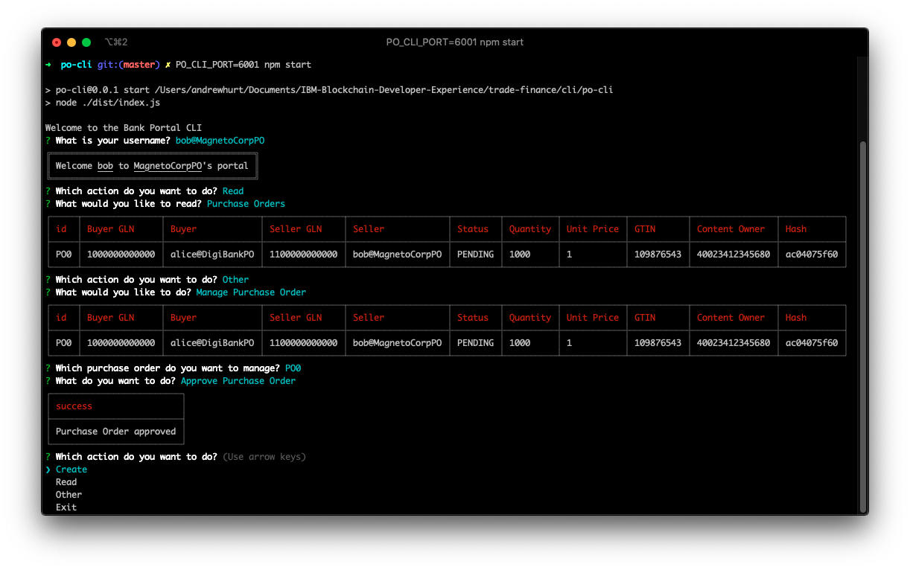
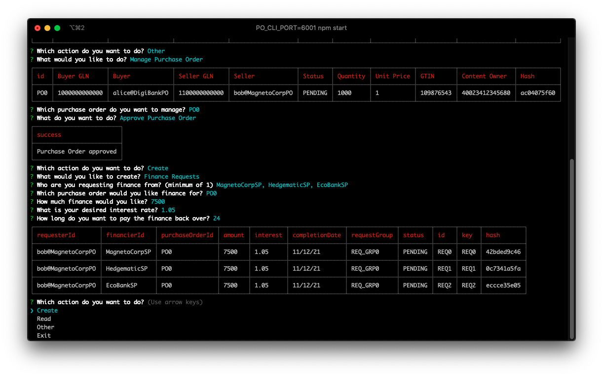
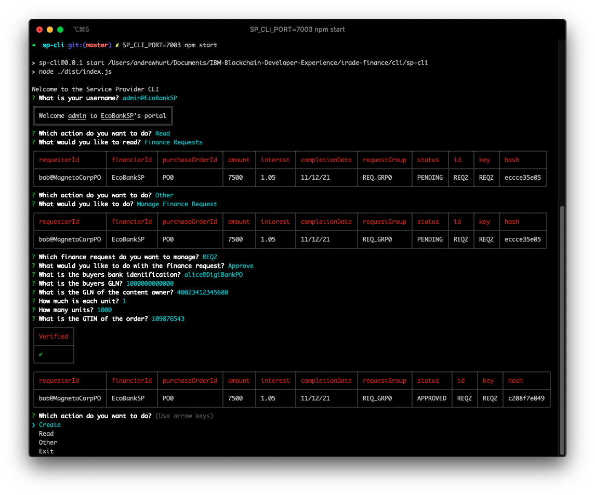
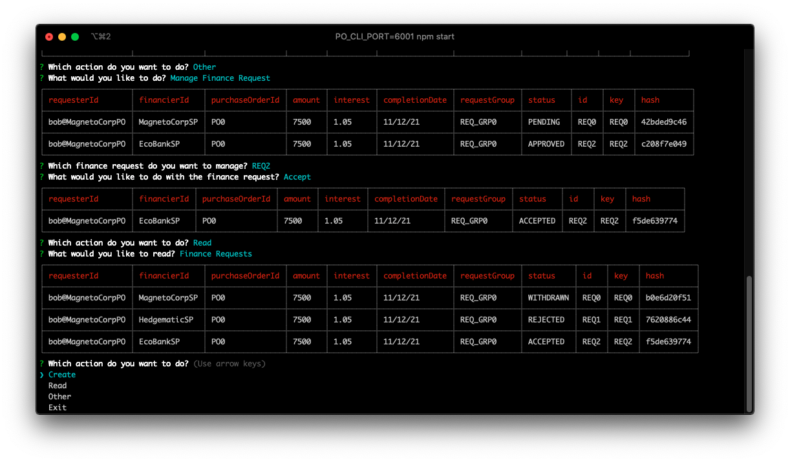

# Running the demo

## Setting up the CLIs
To interact with the network you will need to setup 2 PO CLIs and 4 SP CLIs, one connected to each REST server. Instructions for starting these can be found here:
- [PO CLI](./cli/po-cli)
- [SP CLI](./cli/sp-cli)

Ensure you have the following CLIs

### PO CLIs
| USER                  | PORT |
|-----------------------|------|
| alice@DigiBankPO | 6000 |
| bob@MagnetoCorpPO  | 6001 |

### SP CLIs
| USER                      | PORT |
|---------------------------|------|
| admin@DigiBankSP     | 7000 |
| admin@MagnetoCorpSP    | 7001 |
| admin@HedgematicSP | 7002 |
| admin@EcoBankSP        | 7003 |

## Demo flow
1. Alice creates purchase order
2. Bob accepts purchase order
3. Bob requests finance from 3 SPs (MagnetoCorpSP, HedgematicSP, EcoBankSP)
4. HedgematicSP rejects Bob's finance request
5. EcoBankSP approves Bob's finance request
6. Bob accepts finance from EcoBankSP

## Creating a purchase order
In Alice's CLI select create from the list of options and then select purchase orders. Enter `bob@MagnetoCorpPO` for the seller's identification, hit enter to use the GLN provided, select socks as the item and then hit enter on the default GTIN for socks. Enter 1 as the unit cost, 10000 as the number of units and socks as the item the purchase order is for. The purchase order is now created and is stored in the private date collections of Alice and Bob's EPs.

## Approving a purchase order
In Bob's CLI select read from the list of options and then select purchase orders. Here you should see the purchase order from Alice. Back at the top menu choose other from the list of options then manage purchase order. Select the id which matches the purchase order created by Alice and then choose approve. This updates both the private data stored in Bob and Alice's EPs.

## Requesting finance
Still in Bob's CLI from the top menu select create and then finance request. Select the id which matches the purchase order created by Alice. Press A to select all the offered service providers then press enter. Next select the purchase order ID matching the one created by Alice. Put 7500 for the requested amount, 1.05 for the interest and 24 for the length of finance. This information is stored in Bob's PO's private data and the private data collections of each of the SP's. In this setup an SP's collection is visible to all EPs with which it has agreements. This allows the SP's to read data from one single collection.

## Rejecting a finance request
In HedgematicSP's CLI select read from the list of options and then finance requests. Note that they only see one of the finance requests and not all the requests Bob created. In the top level menu select other and then manage finance request. Choose the request which Bob created and choose reject.

## Approving a finance request
In EcoBankSP's CLI select read from the list of options and then finance requests. In the top level menu select other and then manage finance request. Choose the request which Bob created and choose approve. Since EcoBankSP do not have the purchase order the request relates to in their private data collection they must verify the order against the hash to ensure it is valid (the information would be sent off chain). Enter into the verification questions the details of the purchase order created earlier entering `alice@DigiBankPO` for the buyer, 1000000000000 for the buyer GLN, 40023412345680 for the content owner (Bob's PO's GLN), 1 for the cost per unit, 10000 for the number of units and 109876543 for the GTIN. You can see the values for the content owner and GLN in the purchase order in Bob's CLI.

## Accepting a finance request
Once a finance request is approved bob must accept it (to allow for multiple offers). In Bob's CLI choose other from the top level menu and then select manage finance request. Only two finance requests will appear as a rejected finance request cannot be managed. Select the id of the approved finance request and then accept. If you now read the finance requests you will notice that the finance request from MagnetoCorpSP has been withdrawn as well as the EcoBankSP request being approved.

## Viewing the private data collections
You can use Project Fauxton to view the couchdb state of each of the peers. The addresses are:
- http://localhost:5984/_utils - DigiBankPO
- http://localhost:7984/_utils - MagnetoCorpPO
- http://localhost:9984/_utils - HedgematicPO

Note that tradenet_contract is the world state and collections with dollars in their name are private collections. Those with an "h" in the middle are hashes of private collections.
