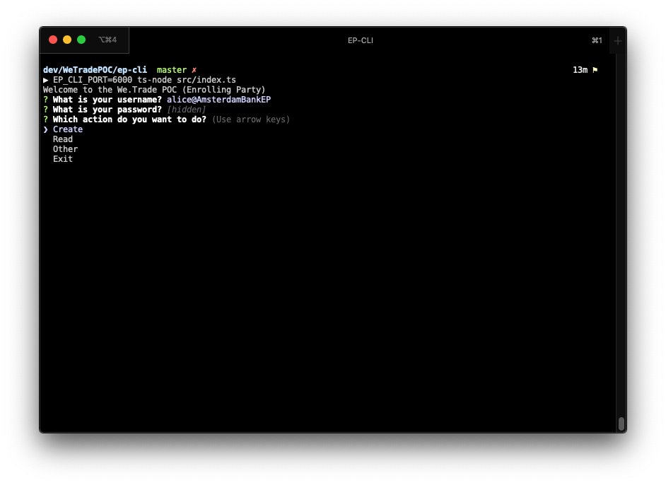
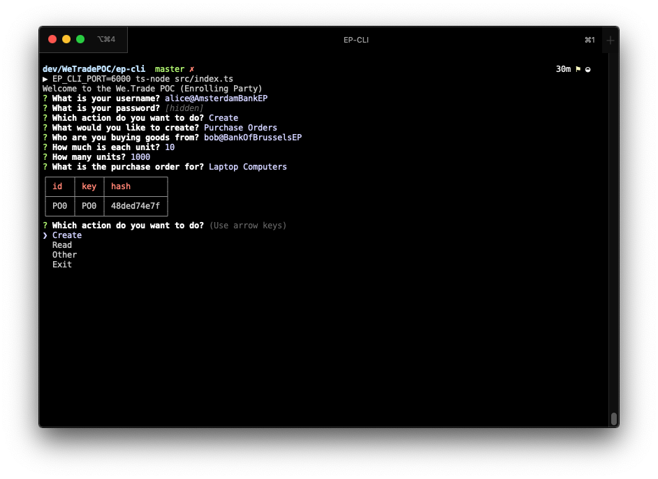
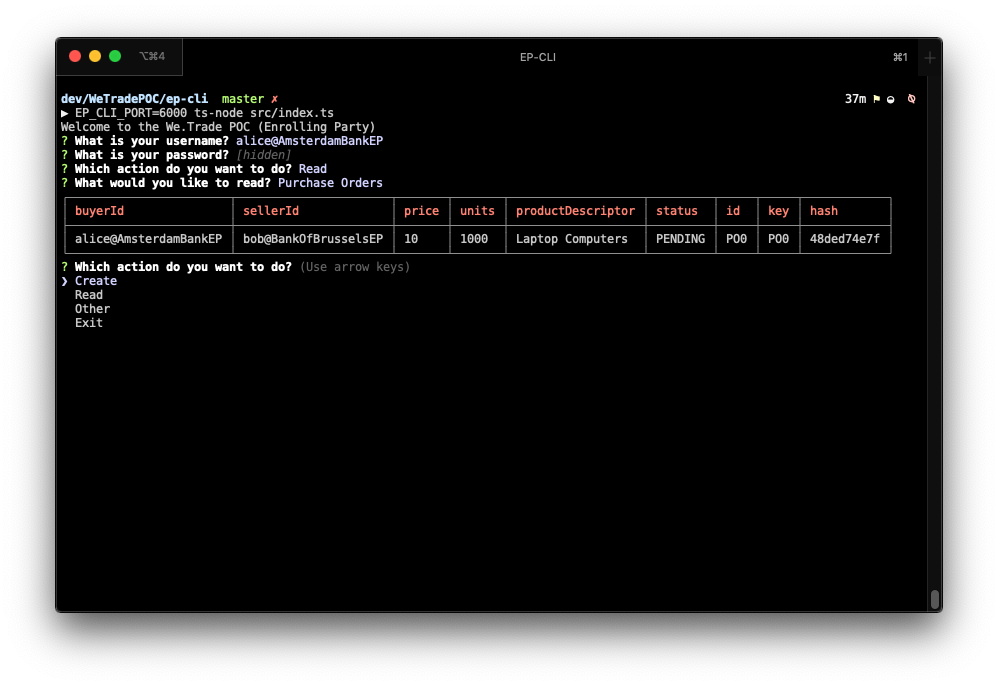
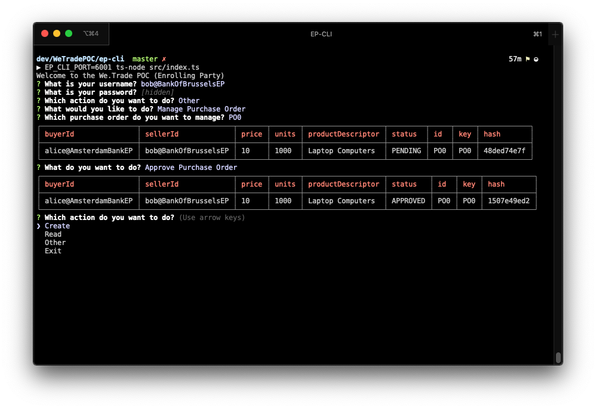

# The Bank Portal CLI

## Configuration

The Command Line Interface (CLI) for this POC is written in Node.js using Inquirer and Commander. The API's work by calling a rest server that runs locally on a port specified by the `PO_CLI_PORT` environment variable.

``` bash
PO_CLI_PORT=6000 npm start
```

## Install

Build the JavaScript from Typescript

```bash
npm build
```

Start the program

```bash
PO_CLI_PORT=6000 npm start
```

## Usage
```bash
PO_CLI_PORT=6000 npm start
```

Select which participant you want to be (Alice or Bob), ensuring that the organization name matches the organization of the REST server the instance is connected to.


From here you can select `Create`, `Read` or `Other`

> All hashes displayed in the UI are truncated

### Create

This allows you to create a `PurchaseOrder` or a `Finance Request`.



The output of creating the `Purchase Order` is the data available on the world state.

### Read

This allows you to view `PurchaseOrders` and `FinanceRequests` as they appear in in the organizations Private Data Collection (PDC).



### Other

> We will switch to to `bob@MagnetoCorpPO` to manage the `PurchaseOrder` `alice@DigiBankPO` just created

This allows you to manage your `Purchase Orders` (accept or close from the perspective of Bob) and `Finance Requests`



### Help

Contact [Liam Grace](mailto:liam.grace@ibm.com) or [Andrew Hurt](mailto:andrew.hurt1@ibm.com) if you have any issues
