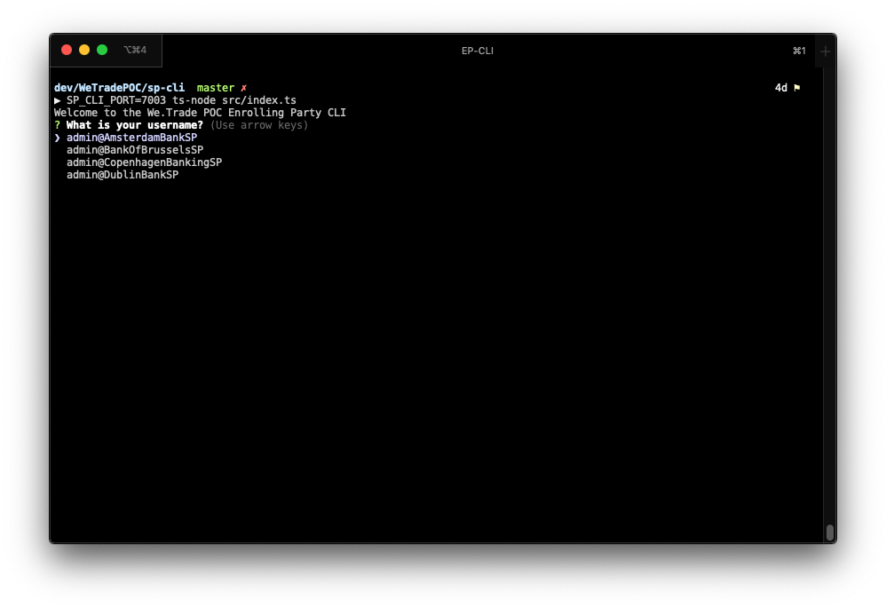
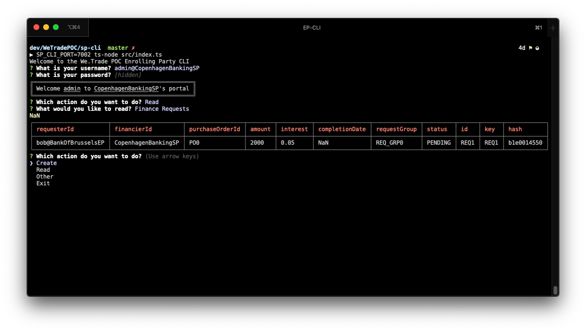
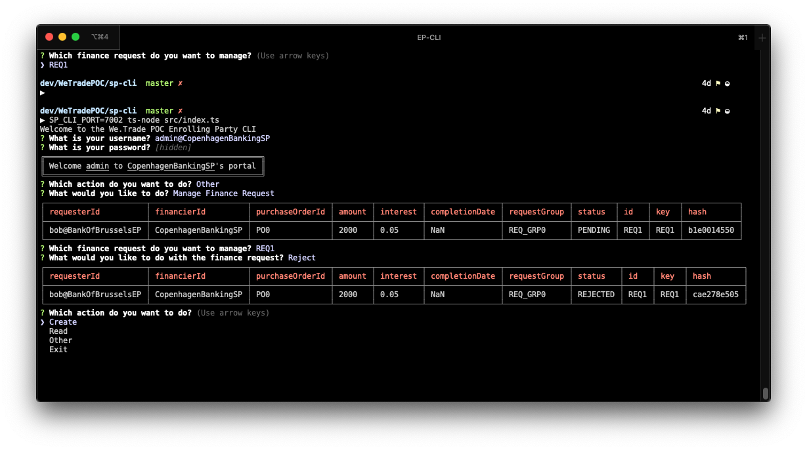

# The Service Providers CLI

## Configuration

The Command Line Interface (CLI) for this POC is written in Node.js using Inquirer and Commander. The APIs work by calling a rest server that runs locally on a port specified by the `SP_CLI_PORT` environment variable.

``` bash
SP_CLI_PORT=7000 npm start
```

## Install

Build the JavaScript from Typescript.

```bash
npm build
```

Start the program

```bash
SP_CLI_PORT=7000 npm start
```

## Usage

```bash
SP_CLI_PORT=7000 npm start
```

Select which participant you want to be (Alice or Bob), ensuring that the organization name matches the organization of the REST server the instance is connected to.


From here you can select `Create`, `Read` or `Other`

> All hashes displayed in the UI are truncated.

### Read

This allows you to view `FinanceRequests` as they appear in in the organizations Private Data Collection (PDC).



### Other

This allows you to manage your `Finance Requests`

> Here the finance request was rejected, revealing the change in status in `HedgematicSP`s PDC.



### Help

Contact [Liam Grace](mailto:liam.grace@ibm.com) or [Andrew Hurt](mailto:andrew.hurt1@ibm.com) if you have any issues.
